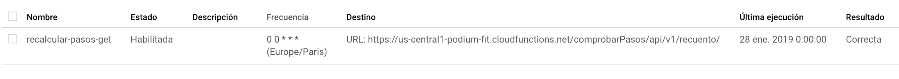
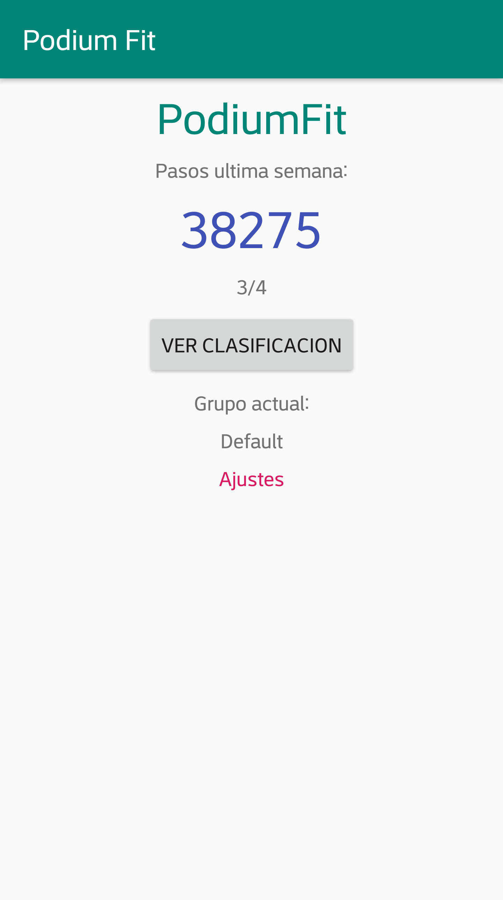
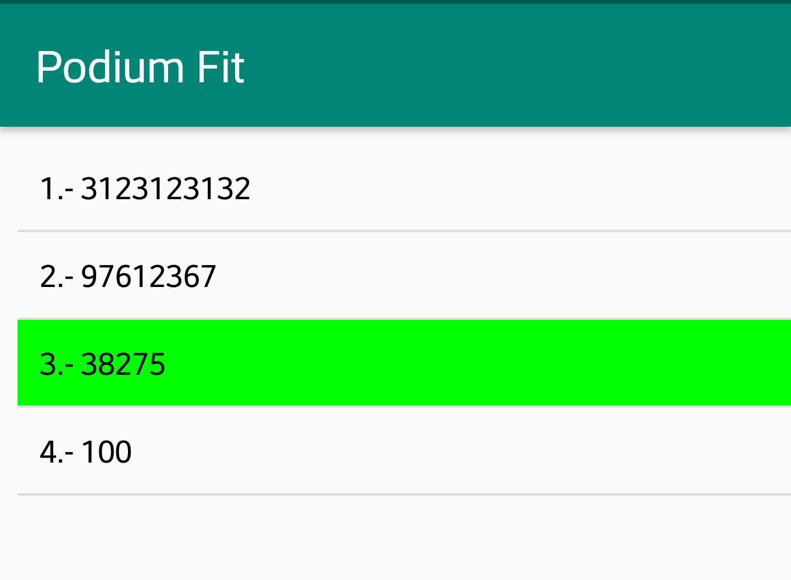
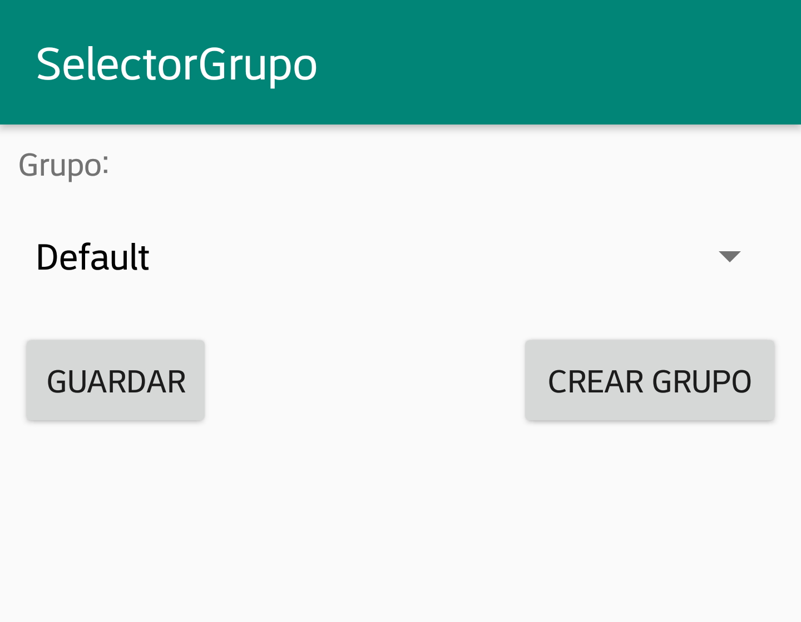

# ikas.fit

Proyecto de fin de curso de Asier Bilbao

## Enunciado
Aplicación Android que utilizando los datos de Google Fit recopila los pasos de la ultima semana.
Dichos datos son usados para crear una clasificación con otros usuarios. La aplicación no almacena
ningún dato personal.

### Base de datos
Firestore es la base de datos que utiliza esta aplicación, los clientes se autenticaran a esta de manera anónima.
En la base de datos, el usuario solo podrá editar los datos de su documento. Las reglas de uso son las siguientes:

```
service cloud.firestore {
  match /databases/{database}/documents {
  	match /{document=**} {
      allow create: if request.auth.uid != null;
  		allow update: if request.auth.uid == resource.data.author_id;
      allow read: if request.auth.uid != null;
    }
  }
}
```

Dos colecciones están presentes en la base de datos: users y grupo.
### users
```json
{
    "author_id": "AmibTKDhFeZW6QHu50Qy00NyQm33",
    "grupo": /grupo/default #ref
    "historico": {
      "0": {"date": "22 de enero de 2019, 23:59:59 UTC+1", "pasos": 1000 },
      "1": {"date": "23 de enero de 2019, 23:59:59 UTC+1", "pasos": 1000 },
      "2": {"date": "24 de enero de 2019, 23:59:59 UTC+1", "pasos": 1000 },
      "3": {"date": "25 de enero de 2019, 23:59:59 UTC+1", "pasos": 1000 },
      "4": {"date": "26 de enero de 2019, 23:59:59 UTC+1", "pasos": 1000 },
      "5": {"date": "27 de enero de 2019, 23:59:59 UTC+1", "pasos": 1000 },
      "6": {"date": "28 de enero de 2019, 23:59:59 UTC+1", "pasos": 1000 },
    },
    "pasos": 7000
   }
   
```

Cada usuario guardara su author_id (token de usuario), el grupo al que pertenece (referencia a /grupo), su histórico de pasos semanal y numero de pasos en total.


Los pasos de un día tiene caducidad, véase [functions](functions) para más informacion.

### grupos
```json
{
  nombre: "Default"
}
```

Las colecciones de grupos tendrán documentos identificados con un id autogenerado, estos documentos guardarán como campos el nombre del grupo.


# functions

En esta aplicación los pasos caducan, si un usuario dispone en su contador pasos de hace mas de una semana, estos serán eliminados y descontados del contador.

Esto es logrado a través de las [funciones](https://firebase.google.com/products/functions/) (`functions`) de firebase, la cual nos permite ejecutar código arbitrario en los servidores de google.

El código fuente es ejecutado todas las noches, el cual elimina de la base de datos todos los registros de más de una semana de antigüedad y recalcula todos los totales.
La motivación de usar este método es que el cliente Android no tendrá que hacer este calculo, ahorrando tiempo de CPU y llamadas a la base de datos.

https://firebase.google.com/docs/functions/get-started?hl=es-419 se encuentra el tutorial para desplegar el código que se encuentra en la carpeta `functions`.

Firestore no permite implementar tareas cron, un servicio externo tendrá que llamar a la función, para ello se utiliza [GCE Cloud Scheduler](https://cloud.google.com/scheduler/). La configuración es la siguiente:




# La app

La app es muy sencilla, en el primer inicio se requerirá al usuario que de permisos para acceder a los datos de Google Fit.

Después de acceder a los datos, el usuario será añadido al grupo por defecto y obtendrá su posición en dicho grupo:


Usando el botón de ver clasificación podrá ver la clasificación del grupo al que corresponde, se indicará con un color llamativo la posición en la que se encuentra el usuario:



El botón de ajustes permitirá al usuario cambiar de grupo e incluso crear un nuevo grupo:



# apk

Una versión pre compilada se encuentra en la carpeta `apks`
